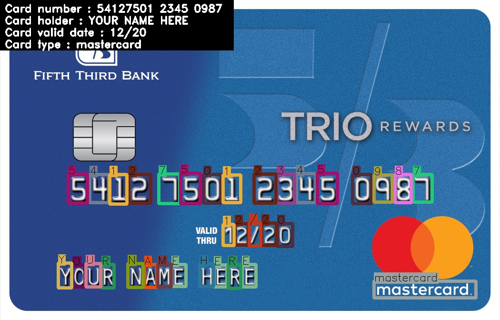

# Credit Card Digits Recognition

Detects and recognizes credit card digits (name, number, valid date, type: visa/mastercard) using AI and CV.

## Getting Started



**I didn't attached the neural network because I worked too hard on the dataset**

To see how I collected datset and trained my model please read 'train.txt'

After you train your model save it as "models/darknet-yolov3_best.weights"

### Prerequisites

python >= 3.6

python libraries:
- opencv-python (cv2)
- flask
- flask_restful
- jsonpickle
- numpy

### Installing

Install libreries using pip3

```bash
pip3 install -r requirements.txt
```

## Usage

1. Standalone application

```bash
python3 main.py <image_path> 
```
Option: image_path = examples/1.jpg  or  image_path = examples/2.jpg

**Image shold be credit card image with minimum background.**


2. Rest API - running https server

```bash
python3 REST_api.py
```

Optional:
```bash
python3 REST_api.py --host <host_ip> --port <port_number>
```

Default argument:

--host = 0.0.0.0

--port = 5000

clinet url should be POST method and looks like this:  http://<host_ip>:<port_number>/pic

**Attach to the request credit card image that filmed from Simplify application.**

## Acknowledgment

Dataset:
- Friends, especially [Guy Chriqui](https://github.com/GuyChriqui) :)
- [Imagaug](https://github.com/aleju/imgaug)

Training:
- [AlexeyAB/Darknet](https://github.com/AlexeyAB/darknet)
- [Training YOLOv3](https://www.learnopencv.com/training-yolov3-deep-learning-based-custom-object-detector/)

## License

This project is licensed under the MIT License - see the [LICENSE.md](LICENSE.md) file for details

## Authors

**Shira Levy** - [Shira Star](https://github.com/ShiraStarL)

"It is only with the hurt one can see rightly, what is essential is invisible to the eye" [Le petit prince](https://i.pinimg.com/originals/d5/0d/44/d50d44dfc6cfbc89f9f27d582fe401e7.jpg) 

